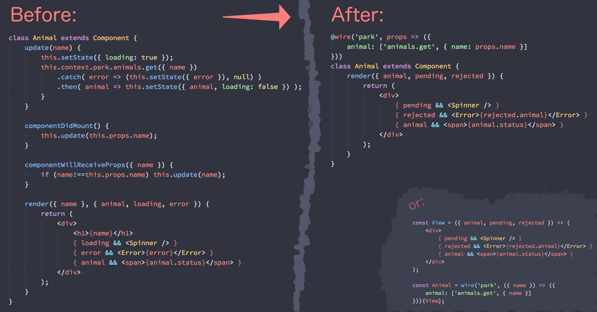

<p align="center">
  
  <br>
  <a href="https://www.npmjs.org/package/wiretie"></a> <a href="https://travis-ci.org/synacor/wiretie"></a>
<a href="https://app.fossa.io/projects/git%2Bgithub.com%2Fsynacor%2Fwiretie?ref=badge_shield" alt="FOSSA Status"></a>
</p>

Wiretie is a Higher Order Component for [Preact][] that resolves (async) values from a model and passes them down as props. It lets you `wire()` components up to data sources.

This provides a uniform and streamlined way to write async components that avoids complex side effects within `componentDidMount()`, and encourages proper instantiability.

Here's what it does for your code:



## Features

-   Standalone and library-agnostic, works with any model
-   Uses the component hierarchy to avoid singletons and duplication
-   Automatically re-renders your component with resolved data
-   Maps props to model methods, with optional transformation
-   Provides Promise status as `pending` and `rejected` props
-   Intelligently reinvokes methods when mapped prop values change
-   Replaces tricky side effecting `componentDidMount()` methods
-   Safely abstracts access to context

* * *

-   [Overview](#overview)   
-   [Handling Loading & Errors](#handling-loading-errors)   
-   [Usage](#usage)   
    -   [Usage With Functional Components](#usage-with-functional-components)   
        -   [_Simple connected view_](#_simple-connected-view_)   
        -   [_Handling pending state_](#_handling-pending-state_)   
        -   [_Splitting things apart_](#_splitting-things-apart_)   
    -   [Usage with Classful Components](#usage-with-classful-components)   
        -   [_Event handlers for mutation_](#_event-handlers-for-mutation_)   
        -   [_Thinking in MVC / MVVM?_](#_thinking-in-mvc-mvvm_)   
-   [Tutorial](#tutorial)   
    -   [A "Hardware" Model](#a-hardware-model)   
-   [API](#api)   
    -   [wire](#wire)   

* * *

## Overview

At a high level, the process for working with `wire()` works like this:

1.  Write a model:
    -   Make sure it's a factory, with parameters for things like configuration
    -   Make sure the returned methods have logical inputs and outputs
    -   Write tests for it, perhaps publish it to npm
2.  Write a pure "view" component:
    -   Data should be plain objects passed in as props
    -   It doesn't have to be a function, but it should work like one
    -   Use state where appropriate: for controlling the view
    -   Use the `pending` and `rejected` properties to respond to unresolved promises and error conditions _([info](#handling-loading---errors))_
3.  Instantiate & expose the model:
    -   Invoke the model (factory) with any options
    -   Store the instance as a Component property or a global
    -   Expose it into [context][] using a [`<Provider>`][]
4.  `wire()` the view up to the model
    -   `wire(name)` connects to `context[name]` (`<Provider name={..}>`)
    -   The 2nd argument (`mapToProps`) is the "wiring"
        -   Keys are the prop names to pass to the view, values are functions to call on the model
        -   Pass args to model functions: `prop: ['foo', {}]`
        -   💭 `a:['b','c']` is like `a = await b('c')`
    -   3rd argument (`mapModelToProps`) lets you map your model instance to view props
        -   Useful for mapping model methods to event handler props
5.  That's it!

* * *

## Handling Loading & Errors

In addition to passing mapped data down as props, `wiretie` also passes special `pending` and `rejected` props.

If any promises are still being waited on, the prop names they are mapped to will be keys in a `pending` object.
Similarly, if any promises have been rejected, their corresponding prop will be a key in `rejected` with a value matching rejection value of the promise.

The `pending` and `rejected` props are `undefined` if there are no promises in that state.
This means if you only need to know if _anything_ is loading, you can just check `if (props.pending)`.

The following example shows states for two properties:

```js
const Demo = wire(null, {
    foo: Promise.resolve('✅'),
    bar: Promise.reject('⚠️')
})( props => {
    console.log(props);
})

render(<Demo />)

// logs:
  { pending: { foo: true, bar: true } }
// ... then:
  { foo: '✅', rejected: { bar: '⚠️' } }
```

> ⏱ Use `pending` to show a "loading" UI for some or all props.
>
> 💥 Use `rejected` to respond to per-prop or overall error states.

* * *

## Usage

The signature for `wire()` consists of three arguments, all of which are optional _(they can be `null`)_.

```js
wire(
    // the property in context where a model instance exists
    <String> contextNamespace,
    // maps incoming props to model method call descriptors
    <Function|Object> mapToProps,
    // maps model properties/methods to props
    <Function> mapModelToProps
)
```

> See [Full `wire()` documentation](#wire) for parameter details.
>
> 🤓 Want to dive straight in? Start with this [Wiretie Codepen Example](https://codepen.io/developit/pen/WOvzzY?editors=0010).

### Usage With Functional Components

#### _Simple connected view_

```js
const Username = wire('user', {
    // pass resolved value from user.getUsername() down as a "username" prop:
    username: 'getUsername'
})( props =>
    <span>
        {props.username}
    </span>
))
```

> 💁 Note: for the first render, `props.username` will be `undefined`.
>
> The component will re-render when getUsername() resolves, passing the value down as `props.username`.

#### _Handling pending state_

Let's show an indicator while waiting for `username` to resolve:

```js
const Username = wire('user', {
    username: 'getUsername'
})( props =>
    <span>
        { props.pending ? 'Loading...' : props.username }
    </span>
))
```

#### _Splitting things apart_

```js
// A pure "view" component:
const Username = props => (
    <span>
        { props.pending ? (
            // display a spinner if we are loading
            <Spinner />
        ) : props.rejected ? (
            // display error message if necessary
            `Error: ${props.rejected.username}`
        ) : (
            // display our data when we have it
            props.username
        }
    </span>
);

// bind the "view" to the model:
const MyUsername = wire('user', {
    username: 'getUsername'
})(Username)
```

> 💁 Notice we've added error handling to the example.

### Usage with Classful Components

```js
@wire('user', { username: 'getUsername' })
class Username extends Component {
    render(props) {
        return (
            <span>
                { props.pending ? (
                    // display a spinner if we are loading
                    <Spinner />
                ) : props.rejected ? (
                    // display error message if necessary
                    `Error: ${props.rejected.username}`
                ) : (
                    // display our data when we have it
                    props.username
                }
            </span>
        );
    }
}
```

#### _Event handlers for mutation_

```js
const mapUserToProps = user => ({
    onChange(e) {
        user.setUsername(e.target.value)
    }
})
@wire('user', { username: 'getUsername' }, mapUserToProps)
class Username extends Component {
    render({ username, onChange }) {
        return <input value={username} onInput={onChange} />
    }
}
```

### _Thinking in MVC / MVVM?_

Let's see the example rewritten using that terminology:

```js
const View = props => (
    <span>
        {props.username}
    </span>
);

const viewModel = wire('user', { username: 'getUsername' });

const Controller = viewModel(View)

render(
    <Provider user={new UserModel()}>
        <Controller />
    </Provider>
)
```

* * *

## Tutorial

### A "Hardware" Model

We're going to build a model that provides access to some computer hardware, in this case your battery level.

Models are just factories: their internals can vary (it doesn't matter).
The only constraint is that they accept configuration and return a (nested) object.

> _**Note:** This library actually doesn't prescribe any of the above,
> it's just recommended to get the best results in conjunction with `wire()`._

Then, we'll wire that model's `battery.getLevel()` method up to a component.
Normally, this would require defining a `componentDidMount()` method that calls a function
(from ... somewhere?), waits for the returned Promise to resolve, then sets a value into state.

Using `wire()` though, we don't need lifecycle methods or state at all.
We also don't need to invent a way to instance and access our model (often a singleton).

First, we'll build a model, `hardware.js`:

```js
// A model is just a factory that returns an object with methods.
export default function hardwareModel() {
    return {
        battery: {
            // Methods return data, or a Promise resolving to data.
            getLevel() {
                return navigator.getBattery()
                    .then( battery => battery.level );
            }
        }
    };
}
```

Then, we write our simple "view" Component, `battery-level.js`:

```js
import { h, Component } from 'preact';

export default class BatteryLevel extends Component {
    render({ batteryLevel='...' }) {
        // On initial render, we wont have received data from the Hardware model yet.
        // That will be indicated by the `batteryLevel` prop being undefined.
        // Thankfully, default parameter values take effect when a key is undefined!
        return <div>Battery Level: {batteryLevel}</div>
    }
}
```

Now we need to instance our model and expose it to all components using `Provider`.
`Provider` just copies any props we give it into `context`.

Somewhere up the tree (often your root component or an `app.js`):

```js
import { h, Component } from 'preact';
import Provider from 'preact-context-provider';
import hardwareModel from './hardware';
import BatteryLevel from './battery-level';

export default class App extends Component {
    hardware = hardwareModel();

    render() {
        return (
            <Provider hardware={this.hardware}>
                <BatteryLevel />
            </Provider>
        );
    }
}
```

Now we just have to wire that up to our view! Back in `battery-level.js`:

_Note the first argument to `wire()` is the namespace of our model in context - defined by the prop name passed to `<Provider>`._

```js
import { h, Component } from 'preact';
import wire from 'wiretie';

// Descendants of <Provider /> can subscribe to data from the model instance:
@wire('hardware', { batteryLevel: 'battery.getLevel' })
export default class BatteryLevel extends Component {
    render({ batteryLevel='...' }) {
        // On initial render, we wont have received data from the Hardware model yet.
        // That will be indicated by the `batteryLevel` prop being undefined.
        // Thankfully, default parameter values take effect when a key is undefined!
        return <div>Battery Level: {batteryLevel}</div>
    }
}
```

Finally, render the app!

```js
import { h, render } from 'preact';
import App from './app';

render(<App />);

// Our app will first render this:
<span>Battery Level: ...</span>

// ...then automatically re-render once the Promise resolves:
<span>Battery Level: 1</span>
```

[preact]: https://preactjs.com

[context]: https://facebook.github.io/react/docs/context.html

[`<provider>`]: https://gist.github.com/developit/5d879edb820228224dc9

* * *

## API

<!-- Generated by documentation.js. Update this documentation by updating the source code. -->

#### Table of Contents

-   [wire](#wire)
    -   [Parameters](#parameters)
    -   [Examples](#examples)
-   [props](#props)
    -   [refresh](#refresh)
    -   [rejected](#rejected)
    -   [pending](#pending)

### wire

Creates a higher order component (HOC) that resolves (async) values from a model to props.
This allows (but importantly abstracts) context access, and manages re-rendering in response to resolved data.
`wire()` is simply a formalization of what is typically done as side-effects within `componentDidMount()`.

#### Parameters

-   `contextNamespace` **[String](https://developer.mozilla.org/docs/Web/JavaScript/Reference/Global_Objects/String)?** The context property at which to obtain a model instance. If empty, all of `context` is used.
-   `mapToProps` **([Object](https://developer.mozilla.org/docs/Web/JavaScript/Reference/Global_Objects/Object) \| [Function](https://developer.mozilla.org/docs/Web/JavaScript/Reference/Statements/function))?** Maps incoming props to model method call descriptors: `['method.name', ...args]`
-   `mapModelToProps` **[Function](https://developer.mozilla.org/docs/Web/JavaScript/Reference/Statements/function)?** Maps model properties/methods to props: `model => ({ prop: model.property })`

#### Examples

```javascript
// resolves news.getTopStories(), passing it down as a "stories" prop
let withTopStories = wire('news', {
	stories: 'getTopStories'
});
export default withTopStories( props =>
	<ul>
		{ props.stories.map( item =>
			<li>{item.title}</li>
		) }
	</ul>
);
```

```javascript
// resolves a news story by ID and passes it down as a "story" prop
let withStory = wire('news', props => ({
	story: ['getStory', props.id]
}));

// Simple "view" functional component to render a story
const StoryView = ({ story }) => (
	<div class="story">
		<h2>{story ? story.title : '...'}</h2>
		<p>{story && story.content}</p>
	</div>
);

// Wrap StoryView in the loader component created by wire()
const Story = withStory(StoryView);

//Get access to the wrapped Component
Story.getWrappedComponent() === StoryView; // true

// Provide a news model into context so Story can wire up to it
render(
	<Provider news={newsModel({ origin: '//news.api' })}>
		<div class="demo">
			<h1>News Story #1234:</h1>
			<Story id="1234" />
		</div>
	</Provider>
);
```

Returns **[Function](https://developer.mozilla.org/docs/Web/JavaScript/Reference/Statements/function)** wiring(Child) -> WireDataWrapper<Child>.  The resulting HOC has a method `getWrappedComponent()` that returns the Child that was wrapped

### props

Props passed to your wrapped component.

#### refresh

A `refresh()` method is passed down as a prop.
Invoking this method re-fetches all data props, bypassing the cache.

#### rejected

If any Promises have been rejected, their values are available in a `props.rejected` Object.
If there are no rejected promises, `props.rejected` is `undefined`.

Type: ([Object](https://developer.mozilla.org/docs/Web/JavaScript/Reference/Global_Objects/Object)&lt;[Error](https://developer.mozilla.org/docs/Web/JavaScript/Reference/Global_Objects/Error)> | [undefined](https://developer.mozilla.org/docs/Web/JavaScript/Reference/Global_Objects/undefined))

#### pending

If any Promises are pending, the corresponding prop names will be keys in a `props.pending` Object.
If there are no pending promises, `props.pending` is `undefined`.

Type: ([Object](https://developer.mozilla.org/docs/Web/JavaScript/Reference/Global_Objects/Object)&lt;[Boolean](https://developer.mozilla.org/docs/Web/JavaScript/Reference/Global_Objects/Boolean)> | [undefined](https://developer.mozilla.org/docs/Web/JavaScript/Reference/Global_Objects/undefined))

## License

[](https://app.fossa.io/projects/git%2Bgithub.com%2Fsynacor%2Fwiretie?ref=badge_large)
